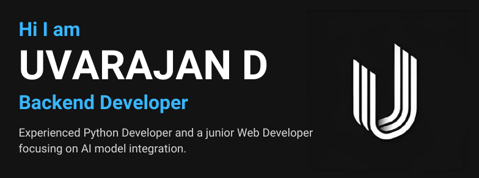

# 

# 👨‍💻 About me

 ### I'm a passionate Backend Developer from India .I love building web applications, exploring Python frameworks, Integrating AI models and participating in hackathons. 🚀

 - 🤖 **Python Developer**: Skilled in creating efficient and scalable backend systems.
 - 🌐 **API Integration Specialist**: Expertise in connecting applications and services seamlessly.
 - 💻 **Junior Web Developer**: Passionate about building intuitive and responsive web applications.
 - 🎯 **Goal**: To contribute to innovative tech solutions that make an impact.

---

# 🛠️ Tech Stack

<b>Programming Languages</b>
 

  
  
  
  
  
  
  
  

---

<b>Frameworks</b>
 

  
  
  
  

---

<b>Database</b>
 

  
  

---

<b>Tools</b>
 

  
  
  

---

### 📊 GitHub Stats

---
# 🔗 Connect With Me  

      
    
     
     
    

